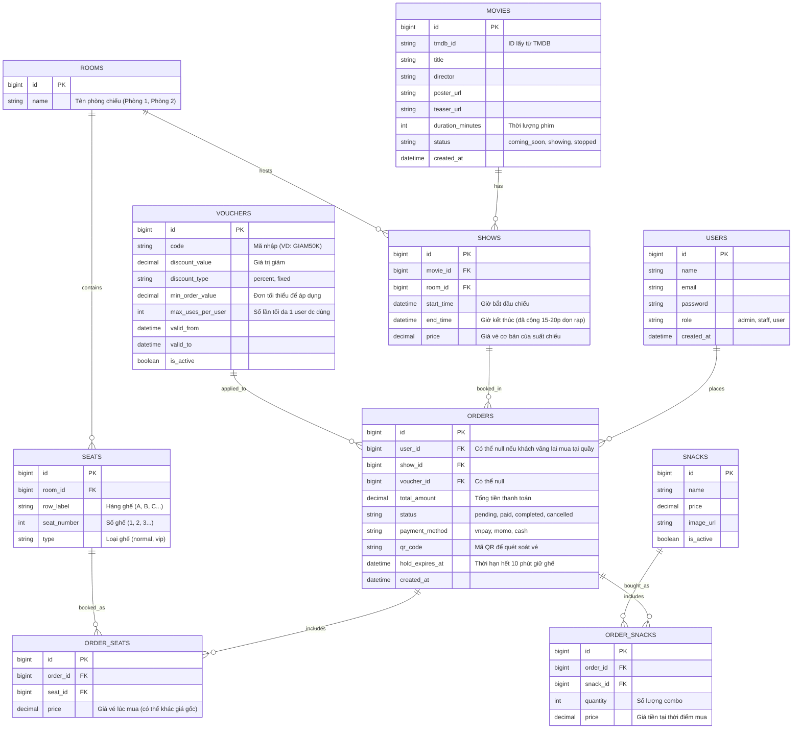

# Sơ đồ quan hệ thực thể (ERD) & Cấu trúc Database

Dưới đây là sơ đồ ERD dựa trên yêu cầu của hệ thống đặt vé xem phim, hỗ trợ phân quyền, lưu trữ ghế, suất chiếu và luồng đặt vé an toàn.

## 1. Sơ đồ ERD (Mermaid)



## 2. Giải pháp Kỹ thuật cho các luồng nghiệp vụ khó

### 2.1. Logic Chọn ghế & Giữ ghế (10 phút)
Yêu cầu: Khách chọn ghế thì ghế bị khóa trong 10 phút, không cho người khác chọn.

**Giải pháp Database:**
- Khi user gửi request chọn ghế, hệ thống sẽ tạo một dòng trong bảng `ORDERS` với trạng thái `status = 'pending'` và cột `hold_expires_at = now() + 10 minutes`. Đồng thời insert các ghế vào `ORDER_SEATS`.
- Để biết một ghế đã bị đặt hay chưa, khi render Sơ đồ ghế, ta query như sau:
  ```sql
  SELECT os.seat_id FROM order_seats os
  JOIN orders o ON os.order_id = o.id
  WHERE o.show_id = {show_id}
  AND (
      o.status IN ('paid', 'completed') -- Vé đã mua
      OR (o.status = 'pending' AND o.hold_expires_at > NOW()) -- Đang bị giữ 10 phút
  )
  ```
- **Chống Concurrency (Bán trùng ghế):** Trong hàm API Chọn ghế, sử dụng **Database Lock (Pessimistic Locking)** của Laravel:
  ```php
  DB::transaction(function () use ($showId, $seatIds) {
      // Dùng lockForUpdate() để khóa record, 2 request gọi cùng lúc thì 1 request phải đợi request kia xong
      $lockedSeats = OrderSeat::whereIn('seat_id', $seatIds)
          ->whereHas('order', function($q) use ($showId) {
              $q->where('show_id', $showId)
                ->where(function($query) {
                    $query->whereIn('status', ['paid', 'completed'])
                          ->orWhere(function($sub) {
                              $sub->where('status', 'pending')
                                  ->where('hold_expires_at', '>', now());
                          });
                });
          })
          ->lockForUpdate() 
          ->get();
      
      if ($lockedSeats->isNotEmpty()) {
          throw new Exception('Ghế đã bị người khác chọn nhanh hơn!');
      }
      // Khởi tạo Order và OrderSeats
  });
  ```

### 2.2. Background Job: Tự động nhả ghế (Timeout)
Thay vì cronjob chạy mỗi phút quét DB (gây nặng server), hãy dùng **Laravel Queue (Delayed Jobs)**:
- Ngay khi tạo Order (giữ ghế) thành công, push một Job vào Queue với delay đúng 10 phút:
  ```php
  ReleaseSeatJob::dispatch($order->id)->delay(now()->addMinutes(10));
  ```
- Code trong `ReleaseSeatJob`:
  ```php
  public function handle() {
      $order = Order::find($this->orderId);
      if ($order && $order->status === 'pending') {
          $order->update(['status' => 'cancelled']);
          // Gắn sự kiện (Event/Websocket) để báo cho Frontend cập nhật UI hiển thị lại ghế trống
      }
  }
  ```

### 2.3. Xử lý thuật toán Timing (Chống trùng lịch chiếu)
Khi Admin thêm suất chiếu, bạn cần tính `end_time = start_time + movie_duration + buffer_time (15-20p)`.
Check trùng lặp thời gian trong cùng một `room_id`:
```php
$isConflict = Show::where('room_id', $roomId)
    ->where(function ($query) use ($newStartTime, $newEndTime) {
        $query->whereBetween('start_time', [$newStartTime, $newEndTime])
              ->orWhereBetween('end_time', [$newStartTime, $newEndTime])
              ->orWhere(function ($q) use ($newStartTime, $newEndTime) {
                  $q->where('start_time', '<=', $newStartTime)
                    ->where('end_time', '>=', $newEndTime);
              });
    })->exists();
```
